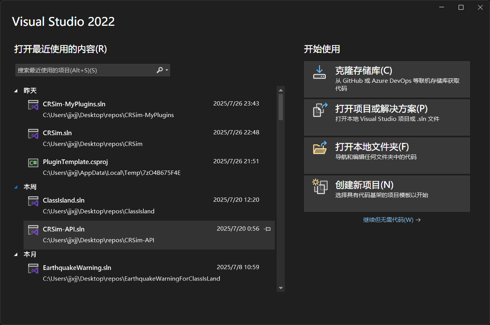
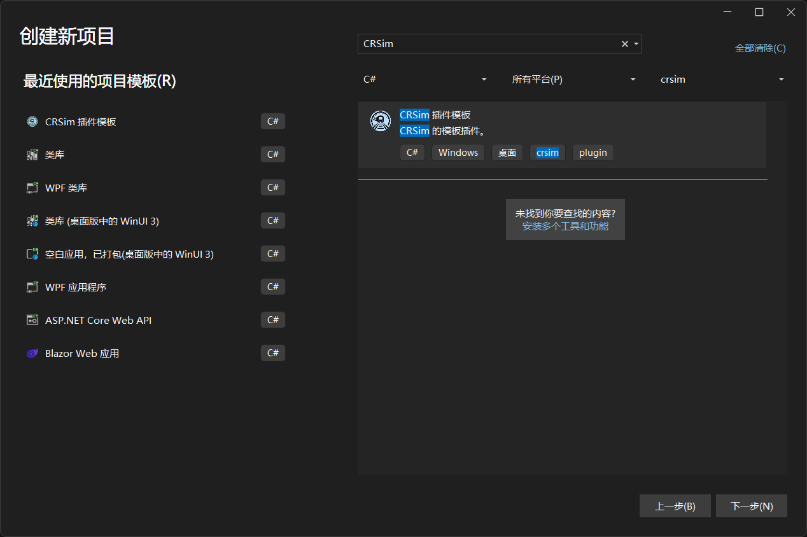
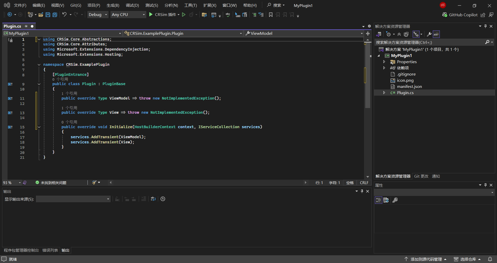
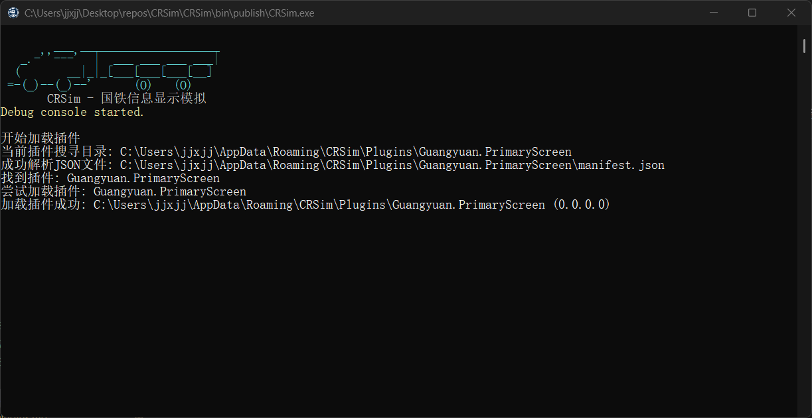

## 设置开发环境

在开始之前，您需要按照[设置 CRSim 插件开发环境](../dev/devlopment-plugins.md)的指引设置插件开发环境。

## 创建项目

您可以使用项目模板快速开始开发。

1. 前往 [插件仓库](https://github.com/denglihong2007/CRSim-PluginRepository/releases/latest) 中下载插件模板（PluginTemplate.zip）
2. 将下载的压缩包复制到`%USERPROFILE%\Documents\Visual Studio 2022\Templates\ProjectTemplates`（以 VS 2022 为例，以你电脑上的具体目录为准）
3. 打开 Visual Studio
4. 在【启动窗口】点击【创建新项目】
    
5. 在模板列表搜索`CRSim`，选择【CRSim 插件模板】创建项目
    
6. 将项目的命名空间由默认的`CRSim.ExamplePlugin`改为你想要的名字，开始你的 CRSim 插件开发之旅吧！
    

## 插件清单文件

插件清单文件包含了插件的基本信息，如插件入口程序集等。使用插件模板创建的项目的清单文件已经基本配置完毕，您只需按照需要进行微调。

项目目录下存在名为 `manifest.json` 的文件，您需要在【属性】中将【复制到输出目录】属性设置为【如果较新则复制】。这样在构建时插件清单文件会被自动复制到输出目录。

清单文件具有以下属性：

| 属性名 | 类型 | 说明 |
| -- | -- | -- |
| entranceAssembly | `string` | 插件入口程序集。在加载插件时将从这个程序集中查找插件入口点。 |
| name | `string` | 插件显示名称 |
| id | `string` | 插件的唯一 id |
| url | `string` | 插件主页 Url |
| version | `string` | 插件版本，如`1.0.0.0` |
| apiVersion | `string` | 此插件面向的 CRSim 版本。此插件将只能在高于或等于此版本的 CRSim 上工作。 |
| author | `string` | 插件作者 |
| type | `string` | 插件类型 |
| description | `string` | 插件描述 |

以下是一个清单文件的示例：

```json title="manifest.json"
{
	"entranceAssembly": "CRSim.ExamplePlugin.dll", //插件入口点程序集名称
	"name": "示例插件", //插件显示名
	"id": "CRSim.ExamplePlugin", //插件唯一标识符
	"url": "https://crsim.tech", //插件开源仓库地址
	"version": "0.0.0.0", //插件版本
	"apiVersion": "3.0.0.0", //插件面向的 CRSim 版本
	"author": "电排骨", //插件作者
	"type": "Others", //插件类型，此处为其它插件
	"description": "这是一个示例插件。" //插件描述
}
```

## 插件入口点

加载插件时，将从清单文件标记的入口程序集中查找以 `CRSim.Core.Abstractions.PluginBase` 为基类，且带有 `CRSim.Core.Attributes.PluginEntrance` 属性的类作为插件入口点，并调用 `Initialize` 方法运行插件自定义的初始化函数。

::: tip
您还可以在 `Initialize` 中完成相关服务的注册。
:::

## 启动项目

点击【CRSim 插件】启动调试。如果没有差错，您可以看到 CRSim 正常启动，并弹出了带有找到插件信息的命令提示符窗口。



🎉恭喜！您成功创建了您的第一个插件！