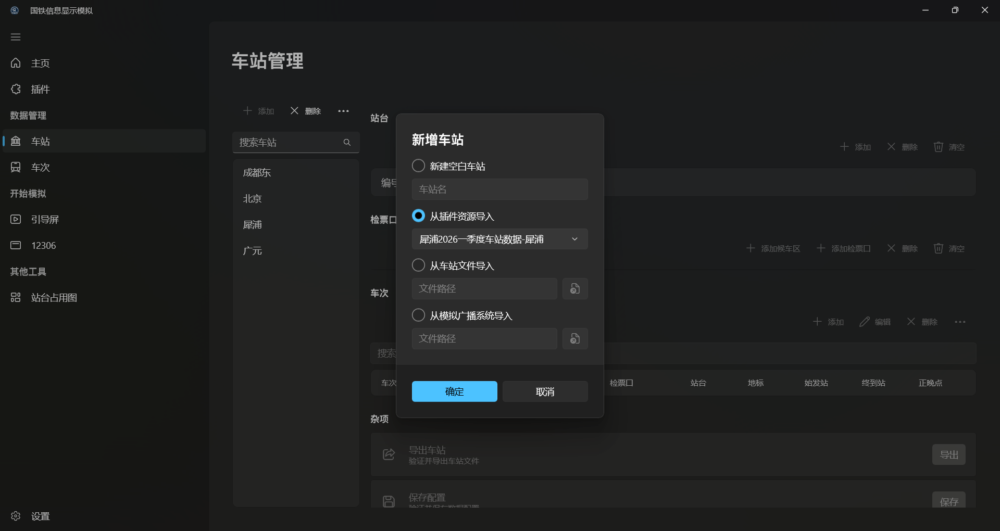

## 简介

资源插件指可以存储车站与车次数据的插件，开发者可以把配置好的数据打包到插件中，便于用户在新建项目时直接使用。



## 资源插件结构

下载[示例插件](https://www.crsim.com.cn/plugins/plugins/Xipu.2026H1.crsp)。

资源插件本质上是一个`.zip`文件，其内部应至少有如下三个文件。

- 自述文件
- 插件图标
- 数据文件

### 自述文件

`manifest.json`是插件的自述文件，用于程序识别。例如：

```json
{
    "entranceAssembly": "data.json",
    "name": "犀浦2026一季度车站数据",
    "id": "Xipu.2026H1",
    "url": "https://github.com/denglihong2007/CRSim-MyPlugins",
    "version": "0.0.0.0",
    "apiVersion": "3.2.0.0",
    "author": "电排骨",
    "type": "StationData",
    "description": "犀浦站2026一季度车站数据，包含国铁和成都地铁的时刻（地铁时刻为推算）。"
}
```
- `entranceAssembly`：数据文件名称，此处指向`data.json`。
- `name`：插件名称。
- `id`：插件ID，插件的唯一标识符，不能重复。
- `url`：项目主页（一般填写仓库地址）。
- `version`：插件版本号。
- `apiVersion`：插件所要求的`CRSim`主程序最低的版本号。
- `author`：插件作者。
- `type`：插件类型，车站资源插件固定为`StationData`。
- `description`：插件简介，将会直接呈现在市场中。

### 图标文件

`icon.png`是插件的图标，必须为无`Alpha`通道`PNG`，建议选择`4:3`的图片，分辨率不小于`120x90`。

### 数据文件

这是储存车站车次数据的核心文件，名字可以改变，格式如下：
```json
{
    "Stations": [
        {
            //车站信息
        }
    ],
    "TrainNumbers": [
        {
            //车次信息
        }
    ]
}
```
::: info
该文件结构与 CRSim 的数据存储文件、资源导出文件完全相同。
:::

例如，如只需要一个车站数据，可以直接将其【导出】后放入插件中。


::: tip
您也可以在一个数据文件中放入多个车站、车次数据。
:::


## 打包插件

将以上三个文件加入一个`.zip`文件，重命名为`插件ID.crsp`，提交到[Github仓库](https://github.com/denglihong2007/CRSim-PluginRepository)即可。