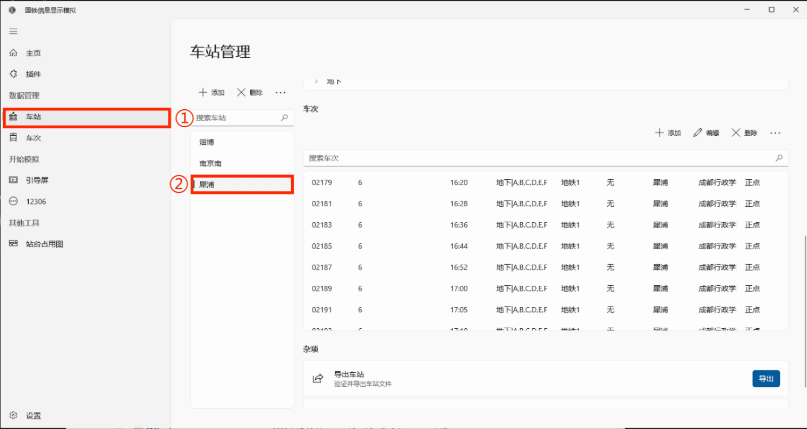
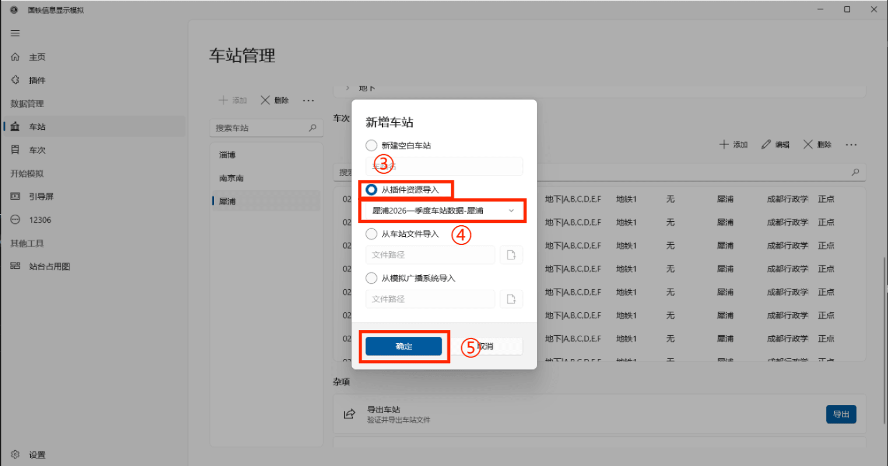
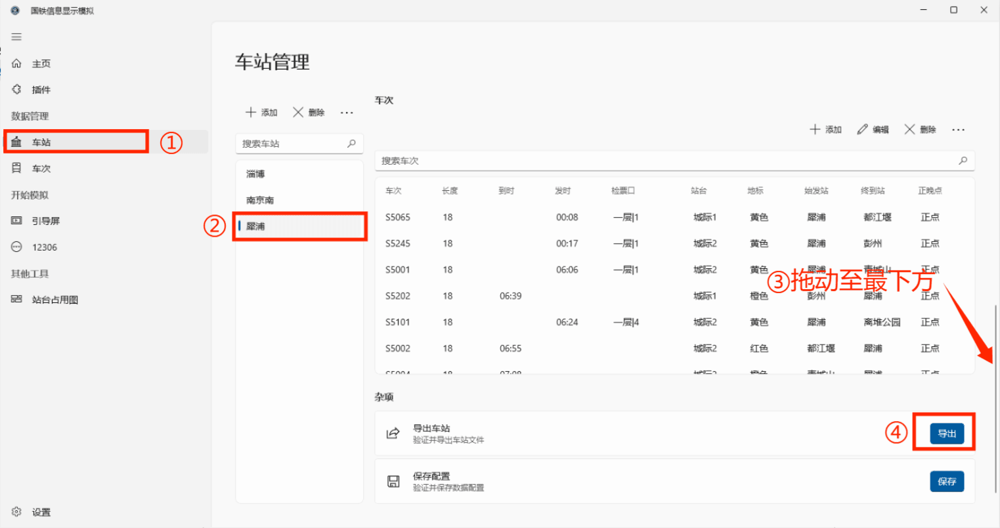

## 简介

资源插件指可以存储车站与车次数据的插件，开发者可以把配置好的车站数据打包到插件中，便于用户直接使用。

[下载](https://www.crsim.com.cn/plugins/plugins/Xipu.2026H1.crsp)示例插件

## 如何使用？

安装插件后，在车站管理点击`+`按钮，选择`从插件资源导入`，选择对应插件，点击`确认`，插件中的车站就导入至车站列表中。




## 资源插件结构

资源插件本质上是一个`.zip`文件，内有如下三个文件。

- `data.json` （文件名可自定义）
- `icon.png`
- `manifest.json`

### data.json

这个文件是储存车站车次数据的核心文件，名字可以改变，格式如下：
```json
{
    "Stations": [
        {
            ...
        }
    ],
    "TrainNumbers": []
}
```


与车站管理中`导出车站`功能所导出的文件本质上一致，如只需要一个车站数据，可以直接放入插件中。



若需要多个车站数据，需要手动将多个`Stations`对象合并到一个数组中或使用下面小工具自动合并。


<!-- 移除外层容器和标题，虚线框作为最外层 -->
<div class="upload-box">
    <input type="file" class="json-file-input" accept=".json" multiple data-role="file-input">
    <div class="file-info" data-role="file-info">未选择文件</div>
    <button class="merge-action-btn" data-role="merge-btn" disabled>合并并下载JSON</button>
    <div class="tip error-tip" data-role="error-tip"></div>
    <div class="tip success-tip" data-role="success-tip"></div>
    <div style="color:#bbb"> @ 此工具使用豆包AI生成 </div>
</div>

<style>
    /* 原外层容器的样式迁移到虚线框（最外层），保留布局一致性 */
    .upload-box {
        max-width: 800px;
        margin: 20px 0;
        padding: 20px;
        border: 2px dashed #ccc; /* 虚线框样式保留 */
        border-radius: 8px; /* 沿用原外层的圆角，更协调 */
    }
    .json-file-input {
        margin: 10px 0;
        display: block;
    }
    .file-info {
        margin: 10px 0;
        padding: 10px;
        background: #f9f9f9;
        border-radius: 4px;
        font-size: 14px;
        white-space: pre-wrap;
        min-height: 40px;
    }
    .merge-action-btn {
        padding: 8px 16px;
        margin-top: 10px;
        background-color: #007bff;
        color: white;
        border: none;
        border-radius: 4px;
        cursor: pointer;
    }
    .merge-action-btn:hover:not(:disabled) {
        background-color: #0056b3;
    }
    .merge-action-btn:disabled {
        background-color: #6c757d;
        cursor: not-allowed;
    }
    .tip {
        margin-top: 10px;
        font-weight: 500;
        min-height: 20px;
    }
    .error-tip {
        color: #dc3545;
    }
    .success-tip {
        color: #28a745;
    }
</style>

<script>
    // 核心：事件委托（绑定到document，不受vuepress动态渲染影响）
    (function() {
        // 定义选择器（通过data属性精准定位，避免冲突）
        const SELECTORS = {
            fileInput: '[data-role="file-input"]',
            fileInfo: '[data-role="file-info"]',
            mergeBtn: '[data-role="merge-btn"]',
            errorTip: '[data-role="error-tip"]',
            successTip: '[data-role="success-tip"]'
        };

        // 1. 监听文件选择事件（委托到document）
        document.addEventListener('change', function(e) {
            if (!e.target.matches(SELECTORS.fileInput)) return;
            
            const fileInput = e.target;
            const fileInfo = fileInput.parentNode.querySelector(SELECTORS.fileInfo);
            const mergeBtn = fileInput.parentNode.querySelector(SELECTORS.mergeBtn);
            const errorTip = fileInput.parentNode.querySelector(SELECTORS.errorTip);
            const successTip = fileInput.parentNode.querySelector(SELECTORS.successTip);

            // 清空提示
            errorTip.textContent = '';
            successTip.textContent = '';

            // 强制获取文件列表（原生属性，不依赖框架）
            const files = fileInput.files;
            const fileCount = files.length;

            if (fileCount === 0) {
                fileInfo.textContent = '未选择文件';
                mergeBtn.disabled = true;
                return;
            }

            // 手动拼接文件列表（避免数组方法兼容问题）
            let fileText = `已选择 ${fileCount} 个文件：\n`;
            for (let i = 0; i < fileCount; i++) {
                fileText += `${i + 1}. ${files[i].name}\n`;
            }
            fileInfo.textContent = fileText.trim();
            mergeBtn.disabled = false;
        });

        // 2. 监听合并按钮点击（委托到document）
        document.addEventListener('click', async function(e) {
            if (!e.target.matches(SELECTORS.mergeBtn)) return;
            
            const mergeBtn = e.target;
            const fileInput = mergeBtn.parentNode.querySelector(SELECTORS.fileInput);
            const fileInfo = mergeBtn.parentNode.querySelector(SELECTORS.fileInfo);
            const errorTip = mergeBtn.parentNode.querySelector(SELECTORS.errorTip);
            const successTip = mergeBtn.parentNode.querySelector(SELECTORS.successTip);

            // 禁用按钮防重复点击
            mergeBtn.disabled = true;
            errorTip.textContent = '';
            successTip.textContent = '';

            // 强制校验文件
            const files = fileInput.files;
            if (files.length === 0) {
                errorTip.textContent = '请先选择要合并的JSON文件！';
                mergeBtn.disabled = false;
                return;
            }

            try {
                const mergedStations = [];
                // 逐个处理文件（原生循环，避免异步兼容问题）
                for (let i = 0; i < files.length; i++) {
                    const file = files[i];
                    // 同步读取文件（彻底避免异步坑）
                    const content = await new Promise((resolve, reject) => {
                        const reader = new FileReader();
                        reader.onload = (ev) => resolve(ev.target.result);
                        reader.onerror = () => reject(new Error(`读取文件「${file.name}」失败`));
                        reader.readAsText(file);
                    });

                    // 解析JSON（严格校验）
                    let jsonData;
                    try {
                        jsonData = JSON.parse(content);
                    } catch (err) {
                        throw new Error(`文件「${file.name}」不是有效的JSON格式`);
                    }

                    // 校验核心结构
                    if (!jsonData || typeof jsonData !== 'object' || !Array.isArray(jsonData.Stations) || !Array.isArray(jsonData.TrainNumbers)) {
                        throw new Error(`文件「${file.name}」格式错误：必须包含Stations和TrainNumbers数组`);
                    }

                    // 合并车站数据
                    mergedStations.push(...jsonData.Stations);
                }

                // 生成最终JSON并下载
                const finalData = {
                    Stations: mergedStations,
                    TrainNumbers: []
                };
                const jsonStr = JSON.stringify(finalData, null, 2);
                
                // 原生下载逻辑（不依赖任何框架）
                const blob = new Blob([jsonStr], { type: 'application/json; charset=utf-8' });
                const url = window.URL.createObjectURL(blob);
                const a = document.createElement('a');
                a.href = url;
                a.download = 'data.json';
                a.style.display = 'none';
                document.body.appendChild(a);
                a.click();
                document.body.removeChild(a);
                window.URL.revokeObjectURL(url);

                // 成功提示+重置状态
                successTip.textContent = `合并成功！共处理 ${files.length} 个文件，车站总数：${mergedStations.length}，文件已下载`;
                fileInput.value = ''; // 清空文件选择
                fileInfo.textContent = '未选择文件';

            } catch (err) {
                errorTip.textContent = `合并失败：${err.message}`;
                mergeBtn.disabled = false; // 失败后重新启用按钮
            }
        });
    })();
</script>


### icon.png

这个文件是插件的图标，必须为无`Alpha`通道`PNG`，建议选择`4:3`的图片，分辨率不小于`120x90`

### manifest.json

这个文件是插件的简介，便于程序和用户识别。示例：
```json
{
    "entranceAssembly": "data.json",
    "name": "犀浦2026一季度车站数据",
    "id": "Xipu.2026H1",
    "url": "https://github.com/denglihong2007/CRSim-MyPlugins",
    "version": "0.0.0.0",
    "apiVersion": "3.2.0.0",
    "author": "电排骨",
    "type": "StationData",
    "description": "犀浦站2026一季度车站数据，包含国铁和成都地铁的时刻（地铁时刻为推算）。"
}
```
- `entranceAssembly`：入口文件，即表示`data.json`的名称。
- `name`：插件名称。
- `id`：插件ID，插件的唯一标识符，不能重复。
- `url`：项目主页（一般填写仓库地址）。
- `version`：插件版本号。
- `apiVersion`：插件所要求的`CRSim`主程序最低的版本号。
- `author`：插件作者。
- `type`：插件类型，资源插件固定为`StationData`。
- `description`：插件简介，将会直接呈现在程序中。

## 打包插件

将以上三个文件加入一个`.zip`文件，重命名为`插件id.crsp`，提交到[github仓库](https://github.com/denglihong2007/CRSim-PluginRepository)